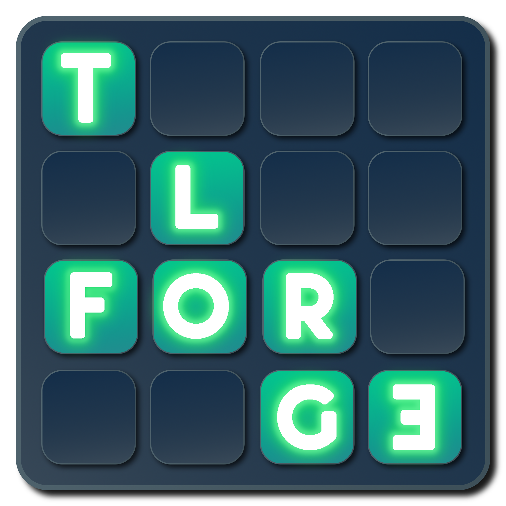

# Tags & Layers Forge

  
  The Unity Tag and Layer Forge is an intuitive tool designed to streamline and enhance the workflow within Unity's development environment by enabling the creation, assignment, and deletion of Tags and Layers directly from the inspector of a GameObject. This extension circumvents the conventional need to navigate through Unity's engine settings, thus saving time and simplifying project organization.

# Features:

Direct Management from the Inspector: 
Perform all Tag and Layer operations without leaving the context of your GameObjects.
Manage your project settings all from one place.

Efficiency: 
Save valuable development time with streamlined operations.

Clarity: 
Gain a better understanding of your project's collision matrix with an intuitive visual interface.

Getting Started:
Download the repository and import it into your Unity project. The Tag and Layer Forge will be accessible either from GameObject's components or context menus, with no additional configuration required.

# Compatibility:

The Unity Tag and Layer Forge has been developed and tested using Unity 2023.2.7f1.

# Support:

If you encounter any issues or have suggestions for future updates, please open an issue on this GitHub repository. Your feedback is invaluable in making this tool even better for the Unity development community.
